# SpringBootClients

In this project I will make a Full REST API using Spring Boot.
It will initialise a client class with an auto-generated ID, a name, 
a unique email address a date of birth and an auto-generate age calculated in base of the date of birth.

This is the final project in QA Software Engineering Bootcamp. I expect the challenge to go smoothly.

Everything went well and for future revisions I would like to implement Spring Security and a Front End.


### ERD

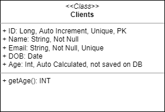

### Getting started

In order to run the API you will need to have java 17 installed in your machine and use the following line in your command line:

```
java -jar ClientsSpringBoot-2.0.0.jar
```

### Built with

- [Maven](https://maven.apache.org/) - Dependency Management

### Authors

- **Luis Nieto** - [luizzitol](https://github.com/luizzitol/)

### Jira Board

You can access my Jira board [Here](https://luisn.atlassian.net/jira/software/projects/LUIS/boards/1/)

### Testing coverage

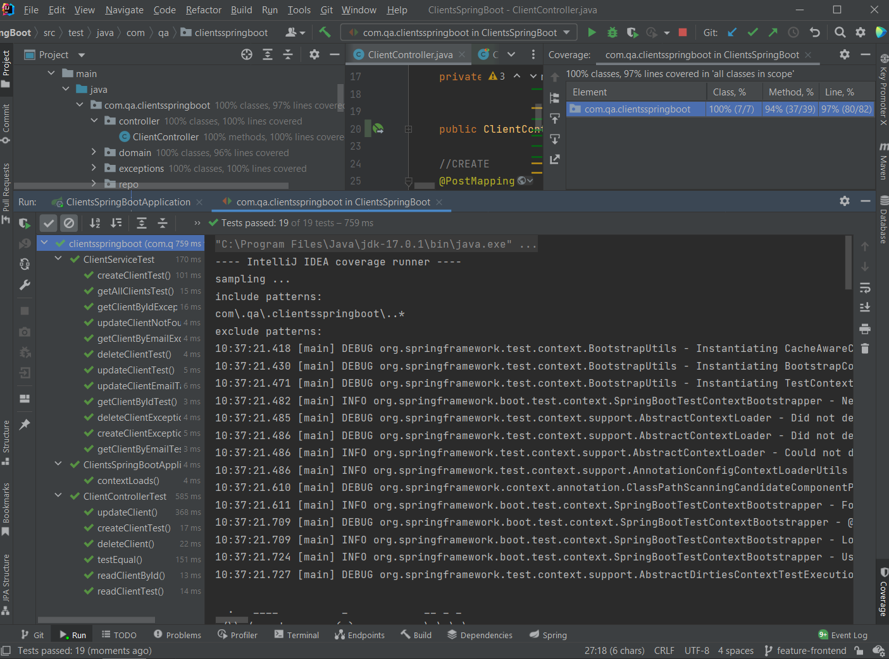

### Database data
Screenshot of database holding the data:
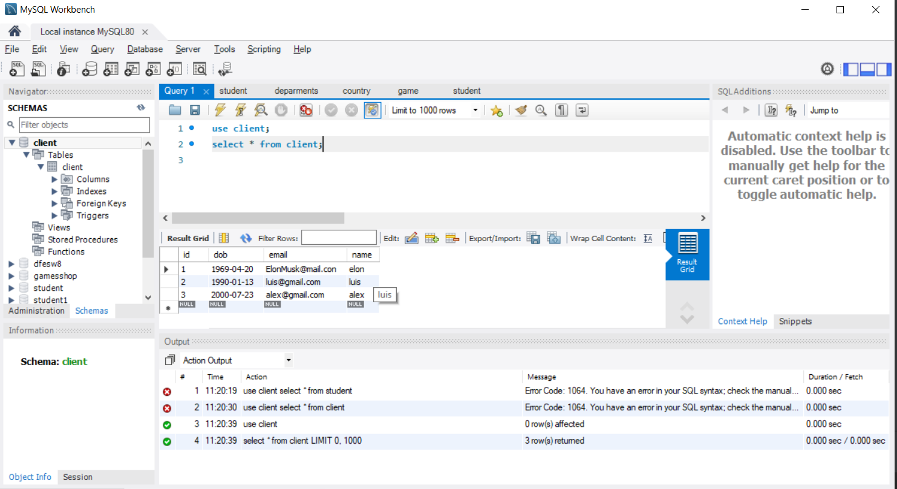

### Postman Requests

Post Request:
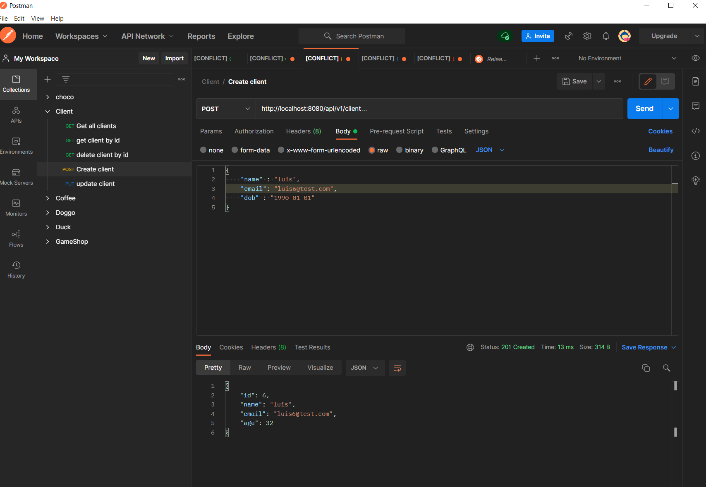
Post Error:
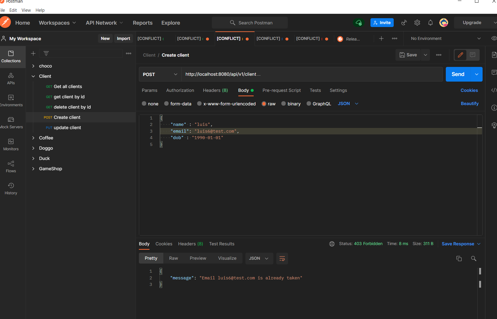

Get Request:
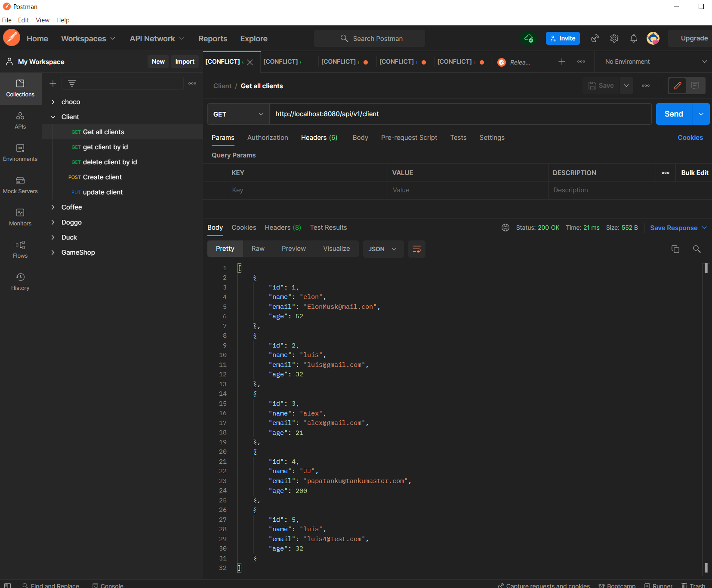

Get by Id Request:
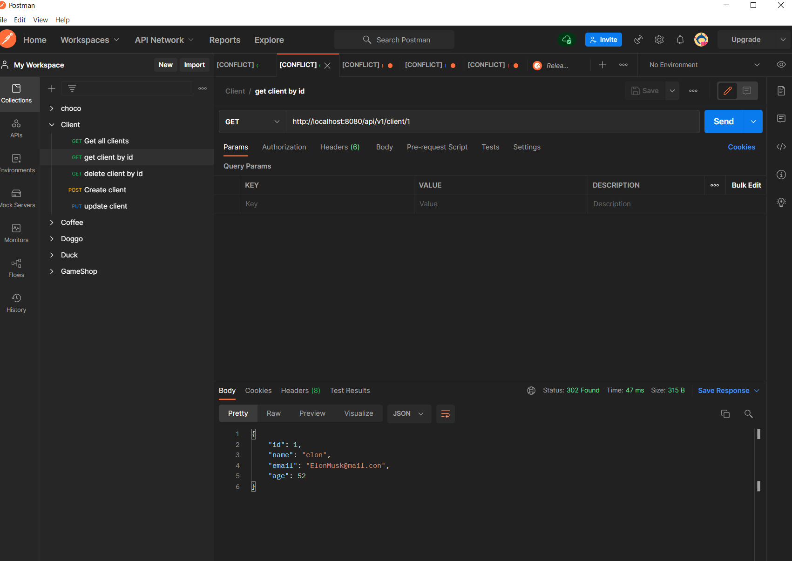

Get by Id, Id not found:
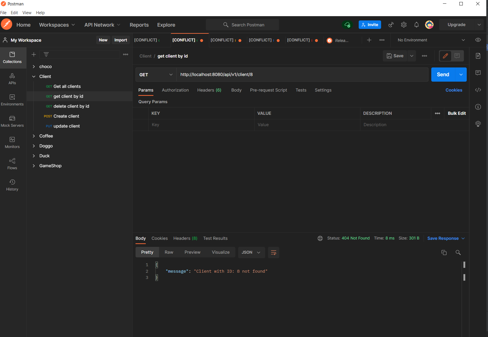

Delete by ID:
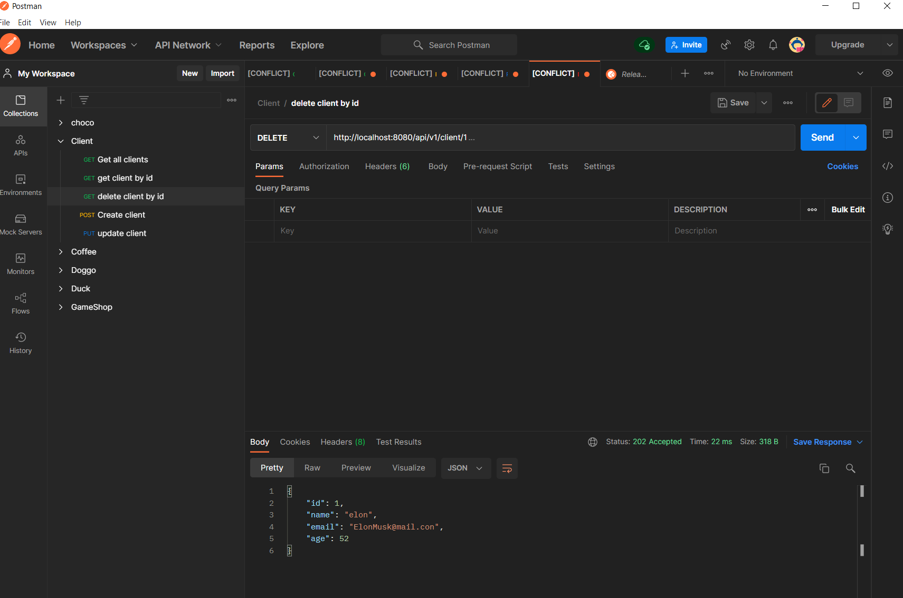

Delete by ID, ID not found:
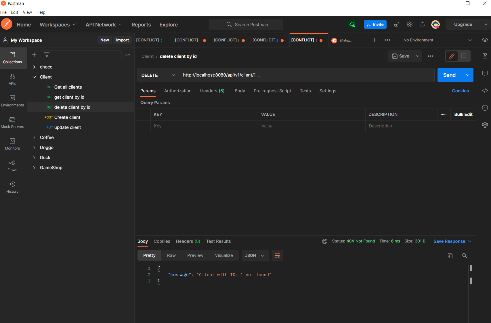

Update Request:
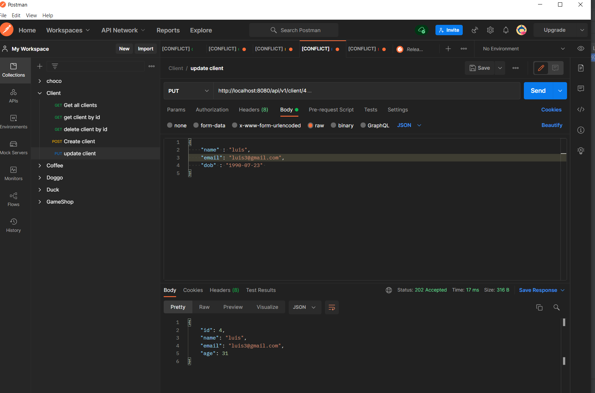


